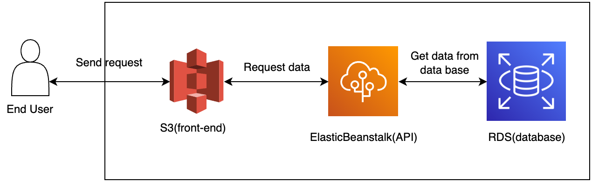

## Infrastructure Description

### Summarize

When user access the link of AWS S3 to using the website. If any request of user need request to data. The front-end(AWS S3) will call back-end(ElasticBeanstalk) to get data. In this step back-end will call to database(RDS) to get data base on user request.